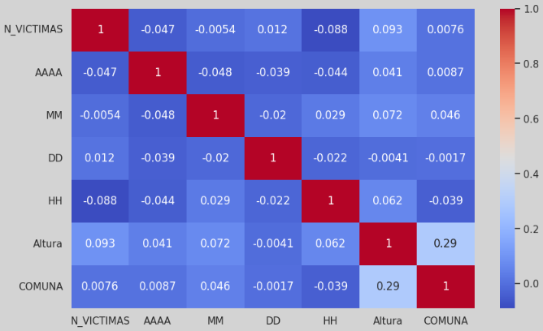
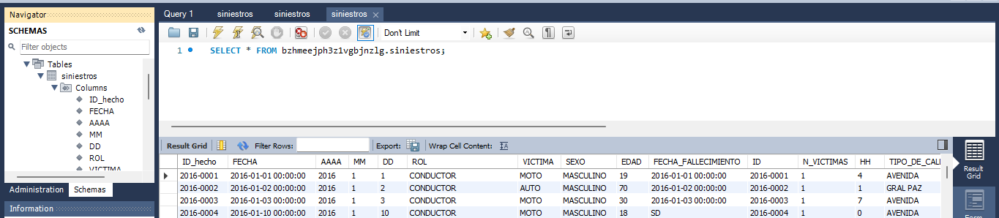
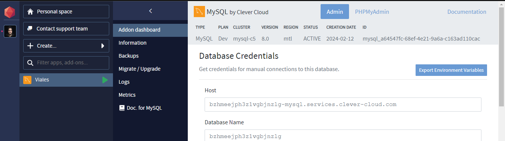
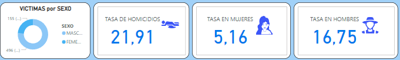

# DATAOPS SINIESTROS VIALES

](<images/Banner Fenix Ofertas y Descuentos Moderno Azul.png>)

# Proyecto de Análisis de Siniestros Viales en la Ciudad Autónoma de Buenos Aires

## Presentación Personal

¡Hola! Mi nombre es Allan Alvarez y estoy emocionado de presentar mi proyecto de análisis de siniestros viales en la Ciudad Autónoma de Buenos Aires. Soy Data Analyst y Data Scientist, apasionado por los datos, y he decidido enfocar mis habilidades en mejorar la seguridad vial en nuestra ciudad.

## Objetivo del Proyecto

El objetivo principal de este proyecto es analizar y visualizar datos relacionados con siniestros viales en la Ciudad de Buenos Aires. A través de este análisis, buscamos identificar patrones, tendencias y áreas de alto riesgo para contribuir a la toma de decisiones informadas y a la implementación de medidas preventivas.

Este proyecto se realizó simulando ser un Data Analist de una consultora; y tiene como finalidad la elaboración de un análisis de datos solicitado por el Observatorio de Movilidad y Seguridad Vial (OMSV), bajo la órbita de la Secretaría de Transporte del Gobierno de la Ciudad Autónoma de Buenos Aires (CABA).

## Descripción del Problema

En el contexto de una ciudad con altas densidades de tráfico y población como Buenos Aires, los siniestros viales representan una preocupación constante. Este proyecto tiene como objetivo principal analizar los datos de homicidios en siniestros viales entre los años 2016 y 2021 para proporcionar información crucial que guíe medidas de prevención efectivas.

## Estructura del Repositorio

*Notebooks:* Contiene el análisis exploratorio de datos (EDA) detallado y documentado. El notebook se centra en la búsqueda de valores faltantes, identificación de outliers y registros duplicados, y presenta gráficos significativos para entender las tendencias.

](images/image-2.png)

*Dashboard:* Aquí encontrarás el  dashboard interactivo. Este dashboard proporciona una visión clara y detallada de las tendencias y patrones descubiertos durante el análisis.

*Data:* Incluye el conjunto de datos utilizado para el análisis, denominado "hechos.xlsx", y "victimas.xlsx". Además, se detallan en el README del dataset las notas importantes para su uso el cual se fusiona para crear el archivo "df_siniestros_final.csv", listo para continuar con las demas etapas.

Las tasas de mortalidad relacionadas con siniestros viales suelen ser un indicador crítico de la seguridad vial en una región. Estas tasas se calculan, generalmente, como el número de muertes por cada cierto número de habitantes o por cada cierta cantidad de vehículos registrados. Reducir estas tasas es un objetivo clave para mejorar la seguridad vial y proteger la vida de las personas en la ciudad.

Para cumplir con ello, los datos iniciales que se utilizan son derivados de un dataset con información sobre homicidios de siniestros viales en la Ciudad de Buenos Aires, durante los años 2016-2021, que es de píblico acceso en la página oficial de CABA. 
Podemos acceder a ellos desde [Datos oficiales](https://data.buenosaires.gob.ar/dataset/victimas-siniestros-viales)

*SQL:* En esta carpeta encontrarás scripts SQL utilizado para crear bases de datos relacionales que pueden ser utilizadas como fuente de datos para herramientas de visualización como Power BI y ademas como fuente remota de los datos.

](images/image-3.png)

*Clever Cloud:* En este link encontrarás las conexiones de la base de datos MySQL utilizados para crear bases de datos en la nube  que pueden ser utilizadas como fuente de datos para herramientas de visualización como Power BI. [Clever Cloud](https://console.clever-cloud.com/) 

](images/image-4.png)

*Material_Apoyo:* Recursos adicionales, como lecturas recomendadas, información del Observatorio de Movilidad y Seguridad Vial, y materiales que respaldan nuestro enfoque y decisiones durante el proyecto. [Población por Año](https://www.estadisticaciudad.gob.ar/eyc/wp-content/uploads/2040/05/CABA1040.xls)

## Dashboard Interactivo

Visita nuestro [Dashboard Interactivo](https://dataops-siniestros-labs.streamlit.app/) para explorar detalladamente los datos. Los filtros te permitirán navegar por la información de manera intuitiva, y la presentación visual facilitará la interpretación de los hallazgos.

## KPIs y Compromisos

En la sección de KPIs, encontrarás gráficos y métricas que miden nuestro progreso hacia dos objetivos clave: reducir en un 10% la tasa de homicidios en siniestros viales y en un 7% la cantidad de accidentes mortales de motociclistas y la cantidad de victimas en comunas con una reduccion del 5%.

](images/image.png)

### Otras Métricas a considerar:
Tasa de accidentes por sexo masculino y femenino comparando con la tasa total.

](images/image-1.png)

El [Repositorio](https://github.com/Karrion1987/DATAOPS_SINIESTROS_VIALES)
 en GitHub está organizado de la siguiente manera:

1. 📂 **DATABASE SQL (MYSQL):**
   - [MYSQL SINIESTROS.sql](<DATABASE SQL/MYSQL SINIESTROS.sql>) - Contiene la base de datos MySQL utilizada en el proyecto.

2. 📂 **DATASET Excel:**
   - [homicidios.xlsx](<DATASET excel/homicidios.xlsx>) - Archivo Excel que contiene el conjunto de datos.

3. 📂 **EDA + ETL:**
   - [EDA.ipynb](<EDA + ETL/EDA.ipynb>) - Cuaderno Jupyter con scripts para el Análisis Exploratorio de Datos (EDA) y procesos de Extracción, Transformación y Carga (ETL).

4. 📂 **Streamlit App:**
   - [Inicio.py](Streamlit/Inicio.py) - Aplicación web de Streamlit para la visualización interactiva de datos.

5. 📂 **Images:**
   - [IMAGENES](images) - Directorio que contiene imágenes utilizadas en el proyecto.

6. 📄 **README:**
   - [README.md](README.md) - Documentación del proyecto con una descripción de los componentes.

7. 📄 **Power BI Dashboard:**
   - [SINIESTROS_VIALES.pbix](SINIESTROS_VIALES.pbix) - Archivo Power BI con el análisis de incidentes vehiculares.

8. 📄 **Requisitos:**
   - [REQUIREMENTS](requirements.txt) - Lista de dependencias del proyecto.

## Conclusión y Recomendaciones

En resumen, nuestro análisis revela que la tasa de homicidios por accidentes de tránsito entre 2016 y 2021 cumplió el objetivo solo en 2019 y 2021 comparando con el semestre anterior en cada caso. Sin embargo, el 2019 fue atípico debido a la pandemia y el confinamiento, lo que redujo significativamente los siniestros viales. Se observó una disminución de la tasa de accidentes con motos solo en 2018 y 2021, sugiriendo que las estrategias de prevención implementadas en esos años podrían ser efectivas para reducir incidentes futuros.

Es importante destacar que la mayoría de los siniestros involucran a peatones y motoristas. Se enfoca en estrategias de prevención y concientización ciudadana para mejorar la seguridad vial. Además, se nota que los accidentes en comunas disminuyeron en 2018 y 2021, señalando la efectividad de las medidas tomadas en esos años.

Estos hallazgos resaltan la necesidad de implementar estrategias similares en los próximos años para lograr una gestión efectiva de los accidentes viales y crear conciencia ciudadana.

## Contribuciones y Colaboraciones

Estoy abierto a contribuciones y colaboraciones de la comunidad. Si tienes ideas, sugerencias o te gustaría colaborar, no dudes en abrir un problema, realizar un pull request o ponerte en contacto conmigo.

## Agradecimientos

Agradezco a [HENRY](https://www.soyhenry.com/?utm_source=google&utm_medium=cpc&utm_campaign=GADS_SEARCH_ARG_BRAND&utm_content=Brand&gad_source=1&gclid=CjwKCAiAivGuBhBEEiwAWiFmYc2lf6Owo0j7b-oTUtTyfzMjHP3A2ElR4p2P0asUimrrxIi2RhpQrBoCBxMQAvD_BwE) por proporcionar datos valiosos para este proyecto.
Este proyecto no solo es un análisis de datos; es un esfuerzo colaborativo para hacer que las calles de Buenos Aires sean más seguras. ¡Gracias por explorar nuestro trabajo! 🚀💛
Gracias por tu interés y apoyo.

### Lenguajes de Programación

### Bibliotecas y Frameworks

### Herramientas de Visualización

### Bases de Datos

### Herramientas de BI y Visualización

### Procesamiento de Datos

## Autor:  Allan Alvarez  

  
   
  Allan Alvarez 
   
  
  

